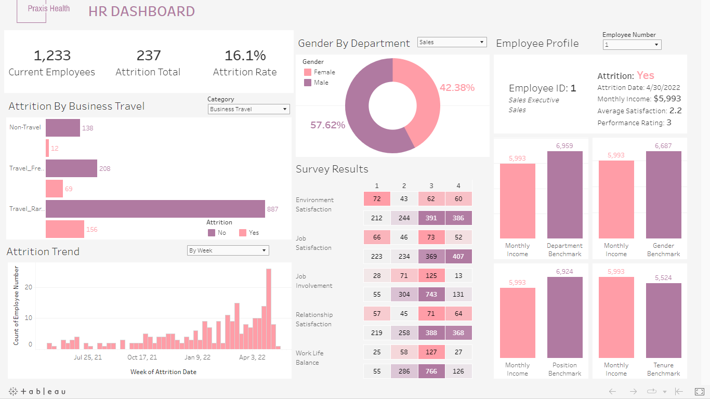


# HR Analysis


**HR data analysis project for a fictional healthcare company, Praxis Health.**

## 📚  Table of Contents
- [📄  Importing The Dataset (SQL)]()
- [👁️‍🗨️ Bird's Eye View (SQL)]()
- [🚪  Attrition Analysis (SQL)]()
- [👥 Employee Satisfaction (SQL)]()
- [🎨 Data Visualization (Tableau)]()

## Importing The Dataset
**Source:** 
Part of the #RWFD (Real World Fake Data) project, dataset available at [data.world](https://data.world/markbradbourne/rwfd-real-world-fake-data-season-2/workspace/file?filename=HR_Attrition.csv)
```sql
CREATE TABLE hr (
attrition_date DATE,
age	INTEGER,
attrition TEXT,
business_travel	TEXT,
daily_rate NUMERIC,
department	TEXT,
distance_from_home	NUMERIC,
education	TEXT,
education_field	TEXT,
employee_count	INTEGER,
employee_number	INTEGER,
environment_satisfaction	TEXT,
gender	TEXT,
hourly_rate	NUMERIC,
job_involvement	INTEGER,
job_level	INTEGER,
job_role	TEXT,
job_satisfaction	INTEGER,
marital_status	TEXT,
monthly_income	NUMERIC,
monthly_rate	NUMERIC,
num_companies_worked	INTEGER,
over_18	TEXT,
over_time	TEXT,
percent_salary_hike	NUMERIC,
performance_rating	INTEGER,
relationship_satisfaction	INTEGER,
standard_hours	NUMERIC,
stock_option_level	INTEGER,
total_working_years	INTEGER,
training_times_last_year	INTEGER,
work_life_balance	INTEGER,
years_at_company	INTEGER,
years_in_current_role	INTEGER,
years_since_last_promotion	INTEGER,
years_with_curr_manager INTEGER
)

-- if using original csv (values separated by tabs):
-- \COPY hr FROM 'C:\Users\Public\hr_analytics_data.csv' WITH CSV HEADER DELIMITER E'\t'

-- if using altered csv (values separated by commas):
-- \COPY hr FROM 'C:\Users\Public\HR_Attrition.csv' WITH CSV HEADER DELIMITER ','

SELECT * FROM hr
LIMIT 5
```
| attrition_date | age | attrition | business_travel   | daily_rate | department             | distance_from_home | education         | education_field | employee_count | employee_number | environment_satisfaction | gender | hourly_rate | job_involvement | job_level | job_role              | job_satisfaction | marital_status | monthly_income | monthly_rate | num_companies_worked | over_18 | over_time | percent_salary_hike | performance_rating | relationship_satisfaction | standard_hours | stock_option_level | total_working_years | training_times_last_year | work_life_balance | years_at_company | years_in_current_role | years_since_last_promotion | years_with_curr_manager |
|----------------|-----|-----------|-------------------|------------|------------------------|--------------------|-------------------|-----------------|----------------|-----------------|--------------------------|--------|-------------|-----------------|-----------|-----------------------|------------------|----------------|----------------|--------------|----------------------|---------|-----------|---------------------|--------------------|---------------------------|----------------|--------------------|---------------------|--------------------------|-------------------|------------------|-----------------------|----------------------------|-------------------------|
| 2022-04-30     | 41  | Yes       | Travel_Rarely     | 1102       | Sales                  | 1                  | Associates Degree | Life Sciences   | 1              | 1               | 2                        | Female | 94          | 3               | 2         | Sales Executive       | 4                | Single         | 5993           | 19479        | 8                    | Y       | Yes       | 11                  | 3                  | 1                         | 80             | 0                  | 8                   | 0                        | 1                 | 6                | 4                     | 0                          | 5                       |
|                | 49  | No        | Travel_Frequently | 279        | Research & Development | 8                  | High School       | Life Sciences   | 1              | 2               | 3                        | Male   | 61          | 2               | 2         | Research Scientist    | 2                | Married        | 5130           | 24907        | 1                    | Y       | No        | 23                  | 4                  | 4                         | 80             | 1                  | 10                  | 3                        | 3                 | 10               | 7                     | 1                          | 7                       |
| 2022-05-03     | 37  | Yes       | Travel_Rarely     | 1373       | Research & Development | 2                  | Associates Degree | Other           | 1              | 4               | 4                        | Male   | 92          | 2               | 1         | Laboratory Technician | 3                | Single         | 2090           | 2396         | 6                    | Y       | Yes       | 15                  | 3                  | 2                         | 80             | 0                  | 7                   | 3                        | 3                 | 0                | 0                     | 0                          | 0                       |
|                | 33  | No        | Travel_Frequently | 1392       | Research & Development | 3                  | Master's Degree   | Life Sciences   | 1              | 5               | 4                        | Female | 56          | 3               | 1         | Research Scientist    | 3                | Married        | 2909           | 23159        | 1                    | Y       | Yes       | 11                  | 3                  | 3                         | 80             | 0                  | 8                   | 3                        | 3                 | 8                | 7                     | 3                          | 0                       |
|                | 27  | No        | Travel_Rarely     | 591        | Research & Development | 2                  | High School       | Medical         | 1              | 7               | 1                        | Male   | 40          | 3               | 1         | Laboratory Technician | 2                | Married        | 3468           | 16632        | 9                    | Y       | No        | 12                  | 3                  | 4                         | 80             | 1                  | 6                   | 3                        | 3                 | 2                | 2                     | 2                          | 2                       |
## Bird's Eye View

**1. Average age (overall + by department and job role)**
```sql
SELECT
ROUND(AVG(age),1) AS average_age
FROM hr
```
| average_age |
|-------------|
| 36.9        |
```sql
SELECT
department,
ROUND(AVG(age),1) AS average_age
FROM hr
GROUP BY 1
```
| department             | average_age |
|------------------------|-------------|
| Human Resources        | 37.8        |
| Research & Development | 37.0        |
| Sales                  | 36.5        |

```sql
SELECT
job_role,
ROUND(AVG(age),1) AS average_age
FROM hr
GROUP BY 1
```
| job_role                  | average_age |
|---------------------------|-------------|
| Manager                   | 46.8        |
| Research Scientist        | 34.2        |
| Healthcare Representative | 39.8        |
| Human Resources           | 35.5        |
| Laboratory Technician     | 34.1        |
| Manufacturing Director    | 38.3        |
| Sales Representative      | 30.4        |
| Sales Executive           | 36.9        |
| Research Director         | 44.0        |

**2. Age group distribution, overall + percentage**
```sql
WITH age_group_cte AS (
SELECT
age,
CASE WHEN age >=18 AND age<25 THEN '<25'
	 WHEN age >=25 AND age<35 THEN '25-34'
	 WHEN age >=35 AND age<45 THEN '35-44'
	 WHEN age >=45 AND age<=55 THEN '45-55'
	 WHEN age >55 THEN '>55' END AS age_group
FROM hr
)

SELECT
age_group,
COUNT(*),
ROUND(100.0*COUNT(*)/SUM(COUNT(*)) OVER (),2) AS pct
FROM age_group_cte
GROUP BY 1
ORDER BY ARRAY_POSITION(ARRAY['<25','25-34','35-44','45-55','>55'],age_group)
```
| age_group | count | pct   |
|-----------|-------|-------|
| <25       | 97    | 6.60  |
| 25-34     | 554   | 37.69 |
| 35-44     | 505   | 34.35 |
| 45-55     | 267   | 18.16 |
| >55       | 47    | 3.20  |

**3. Age group distribution, by department**
```sql
WITH age_group_cte AS (
SELECT
age,
department,
CASE WHEN age >=18 AND age<25 THEN '<25'
	 WHEN age >=25 AND age<35 THEN '25-34'
	 WHEN age >=35 AND age<45 THEN '35-44'
	 WHEN age >=45 AND age<=55 THEN '45-55'
	 WHEN age >55 THEN '>55' END AS age_group
FROM hr
)

SELECT
department,
age_group,
COUNT(*),
ROUND(100.0*COUNT(*)/SUM(COUNT(*)) OVER (PARTITION BY department),2) AS pct
FROM age_group_cte
GROUP BY 1,2
ORDER BY department, ARRAY_POSITION(ARRAY['<25','25-34','35-44','45-55','>55'],age_group)
```
| department             | age_group | count | pct   |
|------------------------|-----------|-------|-------|
| Human Resources        | <25       | 3     | 4.76  |
| Human Resources        | 25-34     | 22    | 34.92 |
| Human Resources        | 35-44     | 25    | 39.68 |
| Human Resources        | 45-55     | 10    | 15.87 |
| Human Resources        | >55       | 3     | 4.76  |
| Research & Development | <25       | 67    | 6.97  |
| Research & Development | 25-34     | 348   | 36.21 |
| Research & Development | 35-44     | 342   | 35.59 |
| Research & Development | 45-55     | 173   | 18.00 |
| Research & Development | >55       | 31    | 3.23  |
| Sales                  | <25       | 27    | 6.05  |
| Sales                  | 25-34     | 184   | 41.26 |
| Sales                  | 35-44     | 138   | 30.94 |
| Sales                  | 45-55     | 84    | 18.83 |
| Sales                  | >55       | 13    | 2.91  |

**4. Gender distribution by department + percentage**
```sql
SELECT
department,
gender,
COUNT(*),
ROUND(100.0*COUNT(*)/SUM(COUNT(*)) OVER (PARTITION BY department),2) AS pct
FROM hr
GROUP BY 1,2
ORDER BY 1,2
```
| department             | gender | count | pct   |
|------------------------|--------|-------|-------|
| Human Resources        | Female | 20    | 31.75 |
| Human Resources        | Male   | 43    | 68.25 |
| Research & Development | Female | 379   | 39.44 |
| Research & Development | Male   | 582   | 60.56 |
| Sales                  | Female | 189   | 42.38 |
| Sales                  | Male   | 257   | 57.62 |

**5. Gender distribution by department + percentage (different display method)**
```sql
SELECT 
department,
COUNT(*) FILTER (WHERE gender='Female') AS female_count,
COUNT(*) FILTER (WHERE gender='Male') AS male_count,
ROUND(100.0*COUNT(*) FILTER (WHERE gender='Female')/COUNT(*),2) AS female_pct,
ROUND(100.0*COUNT(*) FILTER (WHERE gender='Male')/COUNT(*),2) AS male_pct
FROM hr
GROUP BY 1
ORDER BY 1
```
| department             | female_count | male_count | female_pct | male_pct |
|------------------------|--------------|------------|------------|----------|
| Human Resources        | 20           | 43         | 31.75      | 68.25    |
| Research & Development | 379          | 582        | 39.44      | 60.56    |
| Sales                  | 189          | 257        | 42.38      | 57.62    |
**Similarly, we can obtain distributions for any field that interests us, such as job_role , education, monthly_income, etc**


**6. Average years at the company (overall tenure + by department)**
```sql
SELECT
ROUND(AVG(years_at_company),1) AS average_years_at_company
FROM hr
```
| average_years_at_company |
|--------------------------|
| 7.0                      |

```sql
SELECT
department,
ROUND(AVG(years_at_company),1) AS average_years_at_company
FROM hr
GROUP BY 1
```
| department             | average_years_at_company |
|------------------------|--------------------------|
| Human Resources        | 7.2                      |
| Research & Development | 6.9                      |
| Sales                  | 7.3                      |

**7. Average years in the current role (overall + by department)**
```sql
SELECT
ROUND(AVG(years_in_current_role),1) AS average_years_in_current_role
FROM hr
```
| average_years_in_current_role |
|-------------------------------|
| 4.2                           |

```sql
SELECT
department,
ROUND(AVG(years_in_current_role),1) AS average_years_in_current_role
FROM hr
GROUP BY 1
```
| department             | average_years_in_current_role |
|------------------------|-------------------------------|
| Human Resources        | 3.5                           |
| Research & Development | 4.2                           |
| Sales                  | 4.5                           |
**8. Average years since last promotion (overall + by department)**
```sql
SELECT
ROUND(AVG(years_since_last_promotion),1) AS average_years_since_last_promotion
FROM hr
```
| average_years_since_last_promotion |
|------------------------------------|
| 2.2                                |

```sql
SELECT
department,
ROUND(AVG(years_since_last_promotion),1) AS average_years_since_last_promotion
FROM hr
GROUP BY 1
```
| department             | average_years_since_last_promotion |
|------------------------|------------------------------------|
| Human Resources        | 1.8                                |
| Research & Development | 2.1                                |
| Sales                  | 2.4                                |

**9. Average years with the current manager (overall + by department)**
```sql
SELECT
ROUND(AVG(years_with_curr_manager),1) AS average_years_with_curr_manager
FROM hr
```
| average_years_with_curr_manager |
|---------------------------------|
| 4.1                             |
```sql
SELECT
department,
ROUND(AVG(years_with_curr_manager),1) AS average_years_with_curr_manager
FROM hr
GROUP BY 1
```
| department             | average_years_with_curr_manager |
|------------------------|---------------------------------|
| Human Resources        | 3.7                             |
| Research & Development | 4.1                             |
| Sales                  | 4.3                             |
**10. Salary comparisons to benchmarks (tenure, position, department, gender)**
```sql
WITH benchmarks_cte AS (
SELECT
employee_number,
years_at_company AS tenure,
job_role,
department,
gender,
monthly_income AS salary,
ROUND(AVG(monthly_income) OVER (PARTITION BY years_at_company)) AS tenure_salary_benchmark,
ROUND(AVG(monthly_income) OVER (PARTITION BY job_role)) AS job_role_salary_benchmark,
ROUND(AVG(monthly_income) OVER (PARTITION BY department)) AS department_salary_benchmark,
ROUND(AVG(monthly_income) OVER (PARTITION BY gender)) AS gender_salary_benchmark
FROM hr
)

SELECT
employee_number,
tenure,
job_role,
department,
gender,
salary,
tenure_salary_benchmark,
ROUND(100.0*(salary - tenure_salary_benchmark)/tenure_salary_benchmark,1) AS tenure_pct_diff,
job_role_salary_benchmark,
ROUND(100.0*(salary - job_role_salary_benchmark)/job_role_salary_benchmark,1) AS job_role_pct_diff,
department_salary_benchmark,
ROUND(100.0*(salary - department_salary_benchmark)/department_salary_benchmark,1) AS department_pct_diff,
gender_salary_benchmark,
ROUND(100.0*(salary - gender_salary_benchmark)/gender_salary_benchmark,1) AS gender_pct_diff
FROM benchmarks_cte
ORDER BY 1
LIMIT 10
```
| employee_number | tenure | job_role                  | department             | gender | salary | tenure_salary_benchmark | tenure_pct_diff | job_role_salary_benchmark | job_role_pct_diff | department_salary_benchmark | department_pct_diff | gender_salary_benchmark | gender_pct_diff |
|-----------------|--------|---------------------------|------------------------|--------|--------|-------------------------|-----------------|---------------------------|-------------------|-----------------------------|---------------------|-------------------------|-----------------|
| 1               | 6      | Sales Executive           | Sales                  | Female | 5993   | 5524                    | 8.5             | 6924                      | -13.4             | 6959                        | -13.9               | 6687                    | -10.4           |
| 2               | 10     | Research Scientist        | Research & Development | Male   | 5130   | 6762                    | -24.1           | 3240                      | 58.3              | 6281                        | -18.3               | 6381                    | -19.6           |
| 4               | 0      | Laboratory Technician     | Research & Development | Male   | 2090   | 4114                    | -49.2           | 3237                      | -35.4             | 6281                        | -66.7               | 6381                    | -67.2           |
| 5               | 8      | Research Scientist        | Research & Development | Female | 2909   | 6415                    | -54.7           | 3240                      | -10.2             | 6281                        | -53.7               | 6687                    | -56.5           |
| 7               | 2      | Laboratory Technician     | Research & Development | Male   | 3468   | 4954                    | -30.0           | 3237                      | 7.1               | 6281                        | -44.8               | 6381                    | -45.7           |
| 8               | 7      | Laboratory Technician     | Research & Development | Male   | 3068   | 6745                    | -54.5           | 3237                      | -5.2              | 6281                        | -51.2               | 6381                    | -51.9           |
| 10              | 1      | Laboratory Technician     | Research & Development | Female | 2670   | 4681                    | -43.0           | 3237                      | -17.5             | 6281                        | -57.5               | 6687                    | -60.1           |
| 11              | 1      | Laboratory Technician     | Research & Development | Male   | 2693   | 4681                    | -42.5           | 3237                      | -16.8             | 6281                        | -57.1               | 6381                    | -57.8           |
| 12              | 9      | Manufacturing Director    | Research & Development | Male   | 9526   | 7203                    | 32.3            | 7295                      | 30.6              | 6281                        | 51.7                | 6381                    | 49.3            |
| 13              | 7      | Healthcare Representative | Research & Development | Male   | 5237   | 6745                    | -22.4           | 7529                      | -30.4             | 6281                        | -16.6               | 6381                    | -17.9           |

## Attrition Analysis
**1. Retention vs Attrition (absolute + percentage), Total Attrition, Current Employees (number)**
```sql
SELECT
attrition,
COUNT(*),
ROUND(100*COUNT(*)/SUM(COUNT(*)) OVER (),2) AS pct
FROM hr
GROUP BY 1
```
| attrition | count | pct   |
|-----------|-------|-------|
| No        | 1233  | 83.88 |
| Yes       | 237   | 16.12 |

**2.1 Retention vs Attrition by department**
```sql
SELECT
department,
attrition,
COUNT(*),
ROUND(100*COUNT(*)/SUM(COUNT(*)) OVER (PARTITION BY department),2) AS pct
FROM hr
GROUP BY 1,2
ORDER BY 1,2
```
| department             | attrition | count | pct   |
|------------------------|-----------|-------|-------|
| Human Resources        | No        | 51    | 80.95 |
| Human Resources        | Yes       | 12    | 19.05 |
| Research & Development | No        | 828   | 86.16 |
| Research & Development | Yes       | 133   | 13.84 |
| Sales                  | No        | 354   | 79.37 |
| Sales                  | Yes       | 92    | 20.63 |

**2.2 Retention vs Attrition by department (different display method)**
```sql
WITH attr_by_dept AS(
SELECT 
department,
CASE WHEN attrition = 'No' THEN COUNT(*) END AS retention,
CASE WHEN attrition = 'Yes' THEN COUNT(*) END AS attrition,
CASE WHEN attrition = 'No' THEN ROUND(100*COUNT(*)/SUM(COUNT(*)) OVER (PARTITION BY department),2) END AS retention_pct,
CASE WHEN attrition = 'Yes' THEN ROUND(100*COUNT(*)/SUM(COUNT(*)) OVER (PARTITION BY department),2) END AS attrition_pct
FROM hr
GROUP BY department, attrition
)

SELECT
department,
MAX(retention) AS retention,
MAX(attrition) AS attrition,
MAX(retention_pct) AS retention_pct,
MAX(attrition_pct) AS attrition_pct
FROM attr_by_dept
GROUP BY department
ORDER BY department
```
| department             | retention | attrition | retention_pct | attrition_pct |
|------------------------|-----------|-----------|---------------|---------------|
| Human Resources        | 51        | 12        | 80.95         | 19.05         |
| Research & Development | 828       | 133       | 86.16         | 13.84         |
| Sales                  | 354       | 92        | 79.37         | 20.63         |

**3.1 Retention vs Attrition by role**
```sql
SELECT
job_role,
attrition,
COUNT(*),
ROUND(100*COUNT(*)/SUM(COUNT(*)) OVER (PARTITION BY job_role),2) AS pct
FROM hr
GROUP BY 1,2
ORDER BY 1,2
```
| job_role                  | attrition | count | pct   |
|---------------------------|-----------|-------|-------|
| Healthcare Representative | No        | 122   | 93.13 |
| Healthcare Representative | Yes       | 9     | 6.87  |
| Human Resources           | No        | 40    | 76.92 |
| Human Resources           | Yes       | 12    | 23.08 |
| Laboratory Technician     | No        | 197   | 76.06 |
| Laboratory Technician     | Yes       | 62    | 23.94 |
| Manager                   | No        | 97    | 95.10 |
| Manager                   | Yes       | 5     | 4.90  |
| Manufacturing Director    | No        | 135   | 93.10 |
| Manufacturing Director    | Yes       | 10    | 6.90  |
| Research Director         | No        | 78    | 97.50 |
| Research Director         | Yes       | 2     | 2.50  |
| Research Scientist        | No        | 245   | 83.90 |
| Research Scientist        | Yes       | 47    | 16.10 |
| Sales Executive           | No        | 269   | 82.52 |
| Sales Executive           | Yes       | 57    | 17.48 |
| Sales Representative      | No        | 50    | 60.24 |
| Sales Representative      | Yes       | 33    | 39.76 |

**3.2 Retention vs Attrition by role (different display method)**
```sql
WITH attr_by_role AS(
SELECT 
job_role,
CASE WHEN attrition = 'No' THEN COUNT(*) END AS retention,
CASE WHEN attrition = 'Yes' THEN COUNT(*) END AS attrition,
CASE WHEN attrition = 'No' THEN ROUND(100*COUNT(*)/SUM(COUNT(*)) OVER (PARTITION BY job_role),2) END AS retention_pct,
CASE WHEN attrition = 'Yes' THEN ROUND(100*COUNT(*)/SUM(COUNT(*)) OVER (PARTITION BY job_role),2) END AS attrition_pct
FROM hr
GROUP BY job_role, attrition
ORDER BY job_role
)

SELECT
job_role,
MAX(retention) AS retention,
MAX(attrition) AS attrition,
MAX(retention_pct) AS retention_pct,
MAX(attrition_pct) AS attrition_pct
FROM attr_by_role
GROUP BY job_role
ORDER BY job_role
```
| job_role                  | retention | attrition | retention_pct | attrition_pct |
|---------------------------|-----------|-----------|---------------|---------------|
| Healthcare Representative | 122       | 9         | 93.13         | 6.87          |
| Human Resources           | 40        | 12        | 76.92         | 23.08         |
| Laboratory Technician     | 197       | 62        | 76.06         | 23.94         |
| Manager                   | 97        | 5         | 95.10         | 4.90          |
| Manufacturing Director    | 135       | 10        | 93.10         | 6.90          |
| Research Director         | 78        | 2         | 97.50         | 2.50          |
| Research Scientist        | 245       | 47        | 83.90         | 16.10         |
| Sales Executive           | 269       | 57        | 82.52         | 17.48         |
| Sales Representative      | 50        | 33        | 60.24         | 39.76         |

**4.1 Retention vs Attrition by gender**
```sql
SELECT
gender,
attrition,
COUNT(*),
ROUND(100*COUNT(*)/SUM(COUNT(*)) OVER (PARTITION BY gender),2) AS pct
FROM hr
GROUP BY 1,2
ORDER BY 1,2
```
| gender | attrition | count | pct   |
|--------|-----------|-------|-------|
| Female | No        | 501   | 85.20 |
| Female | Yes       | 87    | 14.80 |
| Male   | No        | 732   | 82.99 |
| Male   | Yes       | 150   | 17.01 |

**4.2 Retention vs Attrition by gender (different display method)**
```sql
WITH attr_by_gender AS(
SELECT 
gender,
CASE WHEN attrition = 'No' THEN COUNT(*) END AS retention,
CASE WHEN attrition = 'Yes' THEN COUNT(*) END AS attrition,
CASE WHEN attrition = 'No' THEN ROUND(100*COUNT(*)/SUM(COUNT(*)) OVER (PARTITION BY gender),2) END AS retention_pct,
CASE WHEN attrition = 'Yes' THEN ROUND(100*COUNT(*)/SUM(COUNT(*)) OVER (PARTITION BY gender),2) END AS attrition_pct
FROM hr
GROUP BY gender, attrition
ORDER BY gender
)

SELECT
gender,
MAX(retention) AS retention,
MAX(attrition) AS attrition,
MAX(retention_pct) AS retention_pct,
MAX(attrition_pct) AS attrition_pct
FROM attr_by_gender
GROUP BY gender
ORDER BY gender
```
| gender | retention | attrition | retention_pct | attrition_pct |
|--------|-----------|-----------|---------------|---------------|
| Female | 501       | 87        | 85.20         | 14.80         |
| Male   | 732       | 150       | 82.99         | 17.01         |

**5.1 Retention vs Attrition by education**
```sql
SELECT
education,
attrition,
COUNT(*),
ROUND(100*COUNT(*)/SUM(COUNT(*)) OVER (PARTITION BY education),2) AS pct
FROM hr
GROUP BY 1,2
ORDER BY 1,2
```
| education         | attrition | count | pct   |
|-------------------|-----------|-------|-------|
| Associates Degree | No        | 238   | 84.40 |
| Associates Degree | Yes       | 44    | 15.60 |
| Bachelor's Degree | No        | 473   | 82.69 |
| Bachelor's Degree | Yes       | 99    | 17.31 |
| Doctoral Degree   | No        | 43    | 89.58 |
| Doctoral Degree   | Yes       | 5     | 10.42 |
| High School       | No        | 139   | 81.76 |
| High School       | Yes       | 31    | 18.24 |
| Master's Degree   | No        | 340   | 85.43 |
| Master's Degree   | Yes       | 58    | 14.57 |

**5.2 Retention vs Attrition by education (different display method)**
```sql
WITH attr_by_education AS(
SELECT 
education,
CASE WHEN attrition = 'No' THEN COUNT(*) END AS retention,
CASE WHEN attrition = 'Yes' THEN COUNT(*) END AS attrition,
CASE WHEN attrition = 'No' THEN ROUND(100*COUNT(*)/SUM(COUNT(*)) OVER (PARTITION BY education),2) END AS retention_pct,
CASE WHEN attrition = 'Yes' THEN ROUND(100*COUNT(*)/SUM(COUNT(*)) OVER (PARTITION BY education),2) END AS attrition_pct
FROM hr
GROUP BY education, attrition
ORDER BY education
)

SELECT
education,
MAX(retention) AS retention,
MAX(attrition) AS attrition,
MAX(retention_pct) AS retention_pct,
MAX(attrition_pct) AS attrition_pct
FROM attr_by_education
GROUP BY education
ORDER BY education
```
| education         | retention | attrition | retention_pct | attrition_pct |
|-------------------|-----------|-----------|---------------|---------------|
| Associates Degree | 238       | 44        | 84.40         | 15.60         |
| Bachelor's Degree | 473       | 99        | 82.69         | 17.31         |
| Doctoral Degree   | 43        | 5         | 89.58         | 10.42         |
| High School       | 139       | 31        | 81.76         | 18.24         |
| Master's Degree   | 340       | 58        | 85.43         | 14.57         |

**6.1 Retention vs Attrition by age group**
```sql
WITH age_group_cte AS (
SELECT
age,
CASE WHEN age >=18 AND age<25 THEN '<25'
	 WHEN age >=25 AND age<35 THEN '25-34'
	 WHEN age >=35 AND age<45 THEN '35-44'
	 WHEN age >=45 AND age<=55 THEN '45-55'
	 WHEN age >55 THEN '>55' END AS age_group,
attrition
FROM hr
)

SELECT
age_group,
attrition,
COUNT(*),
ROUND(100*COUNT(*)/SUM(COUNT(*)) OVER (PARTITION BY age_group),2) AS pct
FROM age_group_cte
GROUP BY 1,2
ORDER BY ARRAY_POSITION(ARRAY['<25','25-34','35-44','45-55','>55'],age_group), attrition
```
| age_group | attrition | count | pct   |
|-----------|-----------|-------|-------|
| <25       | No        | 59    | 60.82 |
| <25       | Yes       | 38    | 39.18 |
| 25-34     | No        | 442   | 79.78 |
| 25-34     | Yes       | 112   | 20.22 |
| 35-44     | No        | 454   | 89.90 |
| 35-44     | Yes       | 51    | 10.10 |
| 45-55     | No        | 239   | 89.51 |
| 45-55     | Yes       | 28    | 10.49 |
| >55       | No        | 39    | 82.98 |
| >55       | Yes       | 8     | 17.02 |

**6.2 Retention vs Attrition by age group (different display method)**
```sql
WITH age_group_cte AS (
SELECT
age,
CASE WHEN age >=18 AND age<25 THEN '<25'
	 WHEN age >=25 AND age<35 THEN '25-34'
	 WHEN age >=35 AND age<45 THEN '35-44'
	 WHEN age >=45 AND age<=55 THEN '45-55'
	 WHEN age >55 THEN '>55' END AS age_group,
attrition
FROM hr
--ORDER BY 1
)

, attr_by_age_group AS(
SELECT 
age_group,
CASE WHEN attrition = 'No' THEN COUNT(*) END AS retention,
CASE WHEN attrition = 'Yes' THEN COUNT(*) END AS attrition,
CASE WHEN attrition = 'No' THEN ROUND(100*COUNT(*)/SUM(COUNT(*)) OVER (PARTITION BY age_group),2) END AS retention_pct,
CASE WHEN attrition = 'Yes' THEN ROUND(100*COUNT(*)/SUM(COUNT(*)) OVER (PARTITION BY age_group),2) END AS attrition_pct
FROM age_group_cte
GROUP BY age_group, attrition
--ORDER BY age_group
)

SELECT
age_group,
MAX(retention) AS retention,
MAX(attrition) AS attrition,
MAX(retention_pct) AS retention_pct,
MAX(attrition_pct) AS attrition_pct
FROM attr_by_age_group
GROUP BY age_group
ORDER BY ARRAY_POSITION(ARRAY['<25','25-34','35-44','45-55','>55'],age_group)
```
| age_group | retention | attrition | retention_pct | attrition_pct |
|-----------|-----------|-----------|---------------|---------------|
| <25       | 59        | 38        | 60.82         | 39.18         |
| 25-34     | 442       | 112       | 79.78         | 20.22         |
| 35-44     | 454       | 51        | 89.90         | 10.10         |
| 45-55     | 239       | 28        | 89.51         | 10.49         |
| >55       | 39        | 8         | 82.98         | 17.02         |

**7.1 Retention vs Attrition by amount of business travel**
```sql
SELECT
business_travel,
attrition,
COUNT(*),
ROUND(100*COUNT(*)/SUM(COUNT(*)) OVER (PARTITION BY business_travel),2) AS pct
FROM hr
GROUP BY 1,2
ORDER BY 1,2
```
| business_travel   | attrition | count | pct   |
|-------------------|-----------|-------|-------|
| Non-Travel        | No        | 138   | 92.00 |
| Non-Travel        | Yes       | 12    | 8.00  |
| Travel_Frequently | No        | 208   | 75.09 |
| Travel_Frequently | Yes       | 69    | 24.91 |
| Travel_Rarely     | No        | 887   | 85.04 |
| Travel_Rarely     | Yes       | 156   | 14.96 |

**7.2 Retention vs Attrition by amount of business travel (different display method)**
```sql
WITH attr_by_travel AS(
SELECT 
business_travel,
CASE WHEN attrition = 'No' THEN COUNT(*) END AS retention,
CASE WHEN attrition = 'Yes' THEN COUNT(*) END AS attrition,
CASE WHEN attrition = 'No' THEN ROUND(100*COUNT(*)/SUM(COUNT(*)) OVER (PARTITION BY business_travel),2) END AS retention_pct,
CASE WHEN attrition = 'Yes' THEN ROUND(100*COUNT(*)/SUM(COUNT(*)) OVER (PARTITION BY business_travel),2) END AS attrition_pct
FROM hr
GROUP BY business_travel, attrition
ORDER BY business_travel
)

SELECT
business_travel,
MAX(retention) AS retention,
MAX(attrition) AS attrition,
MAX(retention_pct) AS retention_pct,
MAX(attrition_pct) AS attrition_pct
FROM attr_by_travel
GROUP BY business_travel
ORDER BY business_travel
```
| business_travel   | retention | attrition | retention_pct | attrition_pct |
|-------------------|-----------|-----------|---------------|---------------|
| Non-Travel        | 138       | 12        | 92.00         | 8.00          |
| Travel_Frequently | 208       | 69        | 75.09         | 24.91         |
| Travel_Rarely     | 887       | 156       | 85.04         | 14.96         |

**8.1 Retention vs Attrition by distance from home**
```sql
WITH distance_from_home_cte AS (
SELECT
distance_from_home,
CASE WHEN distance_from_home >=1 AND distance_from_home<10 THEN '<10'
	 WHEN distance_from_home >=10 AND distance_from_home<=20 THEN '10-20'
	 WHEN distance_from_home >20 AND distance_from_home<45 THEN '>20'
	 END AS distance_from_home_group,
attrition
FROM hr
)

SELECT
distance_from_home_group,
attrition,
COUNT(*),
ROUND(100*COUNT(*)/SUM(COUNT(*)) OVER (PARTITION BY distance_from_home_group),2) AS pct
FROM distance_from_home_cte
GROUP BY 1,2
ORDER BY ARRAY_POSITION(ARRAY['<10','10-20','>20'],distance_from_home_group), attrition
```
| distance_from_home_group | attrition | count | pct   |
|--------------------------|-----------|-------|-------|
| <10                      | No        | 807   | 85.85 |
| <10                      | Yes       | 133   | 14.15 |
| 10-20                    | No        | 267   | 81.90 |
| 10-20                    | Yes       | 59    | 18.10 |
| >20                      | No        | 159   | 77.94 |
| >20                      | Yes       | 45    | 22.06 |

**8.2 Retention vs Attrition by distance from home (different display method)**
```sql
WITH distance_from_home_cte AS (
SELECT
distance_from_home,
CASE WHEN distance_from_home >=1 AND distance_from_home<10 THEN '<10'
	 WHEN distance_from_home >=10 AND distance_from_home<=20 THEN '10-20'
	 WHEN distance_from_home >20 AND distance_from_home<45 THEN '>20'
	 END AS distance_from_home_group,
attrition
FROM hr
)

, attr_by_distance_from_home AS(
SELECT 
distance_from_home_group,
CASE WHEN attrition = 'No' THEN COUNT(*) END AS retention,
CASE WHEN attrition = 'Yes' THEN COUNT(*) END AS attrition,
CASE WHEN attrition = 'No' THEN ROUND(100*COUNT(*)/SUM(COUNT(*)) OVER (PARTITION BY distance_from_home_group),2) END AS retention_pct,
CASE WHEN attrition = 'Yes' THEN ROUND(100*COUNT(*)/SUM(COUNT(*)) OVER (PARTITION BY distance_from_home_group),2) END AS attrition_pct
FROM distance_from_home_cte
GROUP BY distance_from_home_group, attrition
ORDER BY distance_from_home_group
)

SELECT
distance_from_home_group,
MAX(retention) AS retention,
MAX(attrition) AS attrition,
MAX(retention_pct) AS retention_pct,
MAX(attrition_pct) AS attrition_pct
FROM attr_by_distance_from_home 
GROUP BY distance_from_home_group
ORDER BY ARRAY_POSITION(ARRAY['<10','10-20','>20'],distance_from_home_group)
```
| distance_from_home_group | retention | attrition | retention_pct | attrition_pct |
|--------------------------|-----------|-----------|---------------|---------------|
| <10                      | 807       | 133       | 85.85         | 14.15         |
| 10-20                    | 267       | 59        | 81.90         | 18.10         |
| >20                      | 159       | 45        | 77.94         | 22.06         |

**9.1 Retention vs Attrition by num_companies_worked**
```sql
SELECT
num_companies_worked,
attrition,
COUNT(*),
ROUND(100*COUNT(*)/SUM(COUNT(*)) OVER (PARTITION BY num_companies_worked),2) AS pct
FROM hr
GROUP BY 1,2
ORDER BY 1,2
```
| num_companies_worked | attrition | count | pct   |
|----------------------|-----------|-------|-------|
| 0                    | No        | 174   | 88.32 |
| 0                    | Yes       | 23    | 11.68 |
| 1                    | No        | 423   | 81.19 |
| 1                    | Yes       | 98    | 18.81 |
| 2                    | No        | 130   | 89.04 |
| 2                    | Yes       | 16    | 10.96 |
| 3                    | No        | 143   | 89.94 |
| 3                    | Yes       | 16    | 10.06 |
| 4                    | No        | 122   | 87.77 |
| 4                    | Yes       | 17    | 12.23 |
| 5                    | No        | 47    | 74.60 |
| 5                    | Yes       | 16    | 25.40 |
| 6                    | No        | 54    | 77.14 |
| 6                    | Yes       | 16    | 22.86 |
| 7                    | No        | 57    | 77.03 |
| 7                    | Yes       | 17    | 22.97 |
| 8                    | No        | 43    | 87.76 |
| 8                    | Yes       | 6     | 12.24 |
| 9                    | No        | 40    | 76.92 |
| 9                    | Yes       | 12    | 23.08 |

**9.2 Retention vs Attrition by num_companies_worked (different display method)**
```sql
WITH attr_by_num_previous_workplaces AS(
SELECT 
num_companies_worked,
CASE WHEN attrition = 'No' THEN COUNT(*) END AS retention,
CASE WHEN attrition = 'Yes' THEN COUNT(*) END AS attrition,
CASE WHEN attrition = 'No' THEN ROUND(100*COUNT(*)/SUM(COUNT(*)) OVER (PARTITION BY num_companies_worked),2) END AS retention_pct,
CASE WHEN attrition = 'Yes' THEN ROUND(100*COUNT(*)/SUM(COUNT(*)) OVER (PARTITION BY num_companies_worked),2) END AS attrition_pct
FROM hr
GROUP BY num_companies_worked, attrition
ORDER BY num_companies_worked
)

SELECT
num_companies_worked,
MAX(retention) AS retention,
MAX(attrition) AS attrition,
MAX(retention_pct) AS retention_pct,
MAX(attrition_pct) AS attrition_pct
FROM attr_by_num_previous_workplaces
GROUP BY num_companies_worked
ORDER BY num_companies_worked
```
| num_companies_worked | retention | attrition | retention_pct | attrition_pct |
|----------------------|-----------|-----------|---------------|---------------|
| 0                    | 174       | 23        | 88.32         | 11.68         |
| 1                    | 423       | 98        | 81.19         | 18.81         |
| 2                    | 130       | 16        | 89.04         | 10.96         |
| 3                    | 143       | 16        | 89.94         | 10.06         |
| 4                    | 122       | 17        | 87.77         | 12.23         |
| 5                    | 47        | 16        | 74.60         | 25.40         |
| 6                    | 54        | 16        | 77.14         | 22.86         |
| 7                    | 57        | 17        | 77.03         | 22.97         |
| 8                    | 43        | 6         | 87.76         | 12.24         |
| 9                    | 40        | 12        | 76.92         | 23.08         |

**10.1 Retention vs Attrition by over_time**
```sql
SELECT
over_time,
attrition,
COUNT(*),
ROUND(100*COUNT(*)/SUM(COUNT(*)) OVER (PARTITION BY over_time),2) AS pct
FROM hr
GROUP BY 1,2
ORDER BY 1,2
```
| over_time | attrition | count | pct   |
|-----------|-----------|-------|-------|
| No        | No        | 944   | 89.56 |
| No        | Yes       | 110   | 10.44 |
| Yes       | No        | 289   | 69.47 |
| Yes       | Yes       | 127   | 30.53 |

**10.2 Retention vs Attrition by over_time (different display method)**
```sql
WITH attr_by_over_time AS(
SELECT 
over_time,
CASE WHEN attrition = 'No' THEN COUNT(*) END AS retention,
CASE WHEN attrition = 'Yes' THEN COUNT(*) END AS attrition,
CASE WHEN attrition = 'No' THEN ROUND(100*COUNT(*)/SUM(COUNT(*)) OVER (PARTITION BY over_time),2) END AS retention_pct,
CASE WHEN attrition = 'Yes' THEN ROUND(100*COUNT(*)/SUM(COUNT(*)) OVER (PARTITION BY over_time),2) END AS attrition_pct
FROM hr
GROUP BY over_time, attrition
ORDER BY over_time
)

SELECT
over_time,
MAX(retention) AS retention,
MAX(attrition) AS attrition,
MAX(retention_pct) AS retention_pct,
MAX(attrition_pct) AS attrition_pct
FROM attr_by_over_time
GROUP BY over_time
ORDER BY over_time
```
| over_time | retention | attrition | retention_pct | attrition_pct |
|-----------|-----------|-----------|---------------|---------------|
| No        | 944       | 110       | 89.56         | 10.44         |
| Yes       | 289       | 127       | 69.47         | 30.53         |

**11.1 Retention vs Attrition by years_at_company**
```sql
WITH years_at_company_cte AS (
SELECT
years_at_company,
CASE WHEN years_at_company < 5 THEN '<5'
	 WHEN years_at_company >= 5 AND years_at_company <= 9 THEN '5-9'
	 WHEN years_at_company >= 10 AND years_at_company <= 14 THEN '10-14'
	 WHEN years_at_company >= 15 AND years_at_company <= 19 THEN '15-19'
	 WHEN years_at_company >= 20 AND years_at_company <= 24 THEN '20-24'
	 WHEN years_at_company >= 25 AND years_at_company <= 29 THEN '25-29'
	 WHEN years_at_company >= 30 AND years_at_company <= 35 THEN '30-35'
	 WHEN years_at_company > 35 THEN '>35'
	 END AS years_at_company_group,
attrition
FROM hr
)

SELECT
years_at_company_group,
attrition,
COUNT(*),
ROUND(100*COUNT(*)/SUM(COUNT(*)) OVER (PARTITION BY years_at_company_group),2) AS pct
FROM years_at_company_cte
GROUP BY 1,2
ORDER BY ARRAY_POSITION(ARRAY['<5','5-9','10-14','15-19','20-24','25-29','30-35','>35'],years_at_company_group), attrition
```
| years_at_company_group | attrition | count | pct    |
|------------------------|-----------|-------|--------|
| <5                     | No        | 439   | 75.69  |
| <5                     | Yes       | 141   | 24.31  |
| 5-9                    | No        | 466   | 88.93  |
| 5-9                    | Yes       | 58    | 11.07  |
| 10-14                  | No        | 184   | 88.46  |
| 10-14                  | Yes       | 24    | 11.54  |
| 15-19                  | No        | 60    | 92.31  |
| 15-19                  | Yes       | 5     | 7.69   |
| 20-24                  | No        | 59    | 92.19  |
| 20-24                  | Yes       | 5     | 7.81   |
| 25-29                  | No        | 12    | 100.00 |
| 30-35                  | No        | 10    | 76.92  |
| 30-35                  | Yes       | 3     | 23.08  |
| >35                    | No        | 3     | 75.00  |
| >35                    | Yes       | 1     | 25.00  |

**11.2 Retention vs Attrition by years_at_company (different display method)**
```sql
WITH years_at_company_cte AS (
SELECT
years_at_company,
CASE WHEN years_at_company < 5 THEN '<5'
	 WHEN years_at_company >= 5 AND years_at_company <= 9 THEN '5-9'
	 WHEN years_at_company >= 10 AND years_at_company <= 14 THEN '10-14'
	 WHEN years_at_company >= 15 AND years_at_company <= 19 THEN '15-19'
	 WHEN years_at_company >= 20 AND years_at_company <= 24 THEN '20-24'
	 WHEN years_at_company >= 25 AND years_at_company <= 29 THEN '25-29'
	 WHEN years_at_company >= 30 AND years_at_company <= 35 THEN '30-35'
	 WHEN years_at_company > 35 THEN '>35'
	 END AS years_at_company_group,
attrition
FROM hr
)

, attr_by_years_at_company AS(
SELECT 
years_at_company_group,
CASE WHEN attrition = 'No' THEN COUNT(*) END AS retention,
CASE WHEN attrition = 'Yes' THEN COUNT(*) END AS attrition,
CASE WHEN attrition = 'No' THEN ROUND(100*COUNT(*)/SUM(COUNT(*)) OVER (PARTITION BY years_at_company_group),2) END AS retention_pct,
CASE WHEN attrition = 'Yes' THEN ROUND(100*COUNT(*)/SUM(COUNT(*)) OVER (PARTITION BY years_at_company_group),2) END AS attrition_pct
FROM years_at_company_cte
GROUP BY years_at_company_group, attrition
ORDER BY years_at_company_group
)

SELECT
years_at_company_group,
MAX(retention) AS retention,
MAX(attrition) AS attrition,
MAX(retention_pct) AS retention_pct,
MAX(attrition_pct) AS attrition_pct
FROM attr_by_years_at_company
GROUP BY years_at_company_group
ORDER BY ARRAY_POSITION(ARRAY['<5','5-9','10-14','15-19','20-24','25-29','30-35','>35'],years_at_company_group)
```
| years_at_company_group | retention | attrition | retention_pct | attrition_pct |
|------------------------|-----------|-----------|---------------|---------------|
| <5                     | 439       | 141       | 75.69         | 24.31         |
| 5-9                    | 466       | 58        | 88.93         | 11.07         |
| 10-14                  | 184       | 24        | 88.46         | 11.54         |
| 15-19                  | 60        | 5         | 92.31         | 7.69          |
| 20-24                  | 59        | 5         | 92.19         | 7.81          |
| 25-29                  | 12        |           | 100.00        |               |
| 30-35                  | 10        | 3         | 76.92         | 23.08         |
| >35                    | 3         | 1         | 75.00         | 25.00         |

**12.1 Retention vs Attrition by years_in_current_role**
```sql
WITH years_in_current_role_cte AS (
SELECT
years_in_current_role,
CASE WHEN years_in_current_role = 0 THEN '<1'
	 WHEN years_in_current_role >= 1 AND years_in_current_role <= 3 THEN '1-3'
	 WHEN years_in_current_role >= 4 AND years_in_current_role <= 6 THEN '4-6'
	 WHEN years_in_current_role >= 7 AND years_in_current_role <= 9 THEN '7-9'
	 WHEN years_in_current_role >= 10 AND years_in_current_role <= 12 THEN '10-12'
	 WHEN years_in_current_role >= 13 AND years_in_current_role <= 15 THEN '13-15'
	 WHEN years_in_current_role > 15 THEN '>15'
	 END AS years_in_current_role_group,
attrition
FROM hr
)

SELECT
years_in_current_role_group,
attrition,
COUNT(*),
ROUND(100*COUNT(*)/SUM(COUNT(*)) OVER (PARTITION BY years_in_current_role_group),2) AS pct
FROM years_in_current_role_cte
GROUP BY 1,2
ORDER BY ARRAY_POSITION(ARRAY['<1','1-3','4-6','7-9','10-12','13-15','>15'],years_in_current_role_group), attrition
```
| years_in_current_role_group | attrition | count | pct    |
|-----------------------------|-----------|-------|--------|
| <1                          | No        | 171   | 70.08  |
| <1                          | Yes       | 73    | 29.92  |
| 1-3                         | No        | 469   | 83.16  |
| 1-3                         | Yes       | 95    | 16.84  |
| 4-6                         | No        | 159   | 89.83  |
| 4-6                         | Yes       | 18    | 10.17  |
| 7-9                         | No        | 334   | 88.36  |
| 7-9                         | Yes       | 44    | 11.64  |
| 10-12                       | No        | 58    | 95.08  |
| 10-12                       | Yes       | 3     | 4.92   |
| 13-15                       | No        | 29    | 87.88  |
| 13-15                       | Yes       | 4     | 12.12  |
| >15                         | No        | 13    | 100.00 |

**12.2 Retention vs Attrition by years_in_current_role (different display method)**
```sql
WITH years_in_current_role_cte AS (
SELECT
years_in_current_role,
CASE WHEN years_in_current_role = 0 THEN '<1'
	 WHEN years_in_current_role >= 1 AND years_in_current_role <= 3 THEN '1-3'
	 WHEN years_in_current_role >= 4 AND years_in_current_role <= 6 THEN '4-6'
	 WHEN years_in_current_role >= 7 AND years_in_current_role <= 9 THEN '7-9'
	 WHEN years_in_current_role >= 10 AND years_in_current_role <= 12 THEN '10-12'
	 WHEN years_in_current_role >= 13 AND years_in_current_role <= 15 THEN '13-15'
	 WHEN years_in_current_role > 15 THEN '>15'
	 END AS years_in_current_role_group,
attrition
FROM hr
)

, attr_by_years_in_current_role AS(
SELECT 
years_in_current_role_group,
CASE WHEN attrition = 'No' THEN COUNT(*) END AS retention,
CASE WHEN attrition = 'Yes' THEN COUNT(*) END AS attrition,
CASE WHEN attrition = 'No' THEN ROUND(100*COUNT(*)/SUM(COUNT(*)) OVER (PARTITION BY years_in_current_role_group),2) END AS retention_pct,
CASE WHEN attrition = 'Yes' THEN ROUND(100*COUNT(*)/SUM(COUNT(*)) OVER (PARTITION BY years_in_current_role_group),2) END AS attrition_pct
FROM years_in_current_role_cte
GROUP BY years_in_current_role_group, attrition
ORDER BY years_in_current_role_group
)

SELECT
years_in_current_role_group,
MAX(retention) AS retention,
MAX(attrition) AS attrition,
MAX(retention_pct) AS retention_pct,
MAX(attrition_pct) AS attrition_pct
FROM attr_by_years_in_current_role
GROUP BY years_in_current_role_group
ORDER BY ARRAY_POSITION(ARRAY['<1','1-3','4-6','7-9','10-12','13-15','>15'],years_in_current_role_group)
```
| years_in_current_role_group | retention | attrition | retention_pct | attrition_pct |
|-----------------------------|-----------|-----------|---------------|---------------|
| <1                          | 171       | 73        | 70.08         | 29.92         |
| 1-3                         | 469       | 95        | 83.16         | 16.84         |
| 4-6                         | 159       | 18        | 89.83         | 10.17         |
| 7-9                         | 334       | 44        | 88.36         | 11.64         |
| 10-12                       | 58        | 3         | 95.08         | 4.92          |
| 13-15                       | 29        | 4         | 87.88         | 12.12         |
| >15                         | 13        |           | 100.00        |               |

**13.1 Retention vs Attrition by monthly_income**
```sql
WITH monthly_income_cte AS (
SELECT
monthly_income,
CASE WHEN monthly_income > 1000 AND monthly_income <= 5000 THEN '1000 - 5000'
	 WHEN monthly_income > 5000 AND monthly_income <= 10000 THEN '5001 - 10000'
	 WHEN monthly_income > 10000 AND monthly_income <= 15000 THEN '10001 - 15000'
	 WHEN monthly_income > 15000 THEN '> 15000'
	 END AS monthly_income_group,
attrition
FROM hr
)

SELECT
monthly_income_group,
attrition,
COUNT(*),
ROUND(100*COUNT(*)/SUM(COUNT(*)) OVER (PARTITION BY monthly_income_group),2) AS pct
FROM monthly_income_cte
GROUP BY 1,2
ORDER BY ARRAY_POSITION(ARRAY['1000 - 5000','5001 - 10000','10001 - 15000','> 15000'],monthly_income_group), attrition
```
| monthly_income_group | attrition | count | pct   |
|----------------------|-----------|-------|-------|
| 1000 - 5000          | No        | 586   | 78.24 |
| 1000 - 5000          | Yes       | 163   | 21.76 |
| 5001 - 10000         | No        | 391   | 88.86 |
| 5001 - 10000         | Yes       | 49    | 11.14 |
| 10001 - 15000        | No        | 128   | 86.49 |
| 10001 - 15000        | Yes       | 20    | 13.51 |
| > 15000              | No        | 128   | 96.24 |
| > 15000              | Yes       | 5     | 3.76  |

**13.2 Retention vs Attrition by monthly_income (different display method)**
```sql
WITH monthly_income_cte AS (
SELECT
monthly_income,
CASE WHEN monthly_income > 1000 AND monthly_income <= 5000 THEN '1000 - 5000'
	 WHEN monthly_income > 5000 AND monthly_income <= 10000 THEN '5001 - 10000'
	 WHEN monthly_income > 10000 AND monthly_income <= 15000 THEN '10001 - 15000'
	 WHEN monthly_income > 15000 THEN '> 15000'
	 END AS monthly_income_group,
attrition
FROM hr
)
, attr_by_monthly_income AS(
SELECT 
monthly_income_group,
CASE WHEN attrition = 'No' THEN COUNT(*) END AS retention,
CASE WHEN attrition = 'Yes' THEN COUNT(*) END AS attrition,
CASE WHEN attrition = 'No' THEN ROUND(100*COUNT(*)/SUM(COUNT(*)) OVER (PARTITION BY monthly_income_group),2) END AS retention_pct,
CASE WHEN attrition = 'Yes' THEN ROUND(100*COUNT(*)/SUM(COUNT(*)) OVER (PARTITION BY monthly_income_group),2) END AS attrition_pct
FROM monthly_income_cte
GROUP BY monthly_income_group, attrition
ORDER BY monthly_income_group
)

SELECT
monthly_income_group,
MAX(retention) AS retention,
MAX(attrition) AS attrition,
MAX(retention_pct) AS retention_pct,
MAX(attrition_pct) AS attrition_pct
FROM attr_by_monthly_income
GROUP BY monthly_income_group
ORDER BY ARRAY_POSITION(ARRAY['1000 - 5000','5001 - 10000','10001 - 15000','> 15000'],monthly_income_group)
```
| monthly_income_group | retention | attrition | retention_pct | attrition_pct |
|----------------------|-----------|-----------|---------------|---------------|
| 1000 - 5000          | 586       | 163       | 78.24         | 21.76         |
| 5001 - 10000         | 391       | 49        | 88.86         | 11.14         |
| 10001 - 15000        | 128       | 20        | 86.49         | 13.51         |
| > 15000              | 128       | 5         | 96.24         | 3.76          |

**14.1 Retention vs Attrition by stock_option_level**
```sql
SELECT
stock_option_level,
attrition,
COUNT(*),
ROUND(100*COUNT(*)/SUM(COUNT(*)) OVER (PARTITION BY stock_option_level),2) AS pct
FROM hr
GROUP BY 1,2
ORDER BY 1,2
```
| stock_option_level | attrition | count | pct   |
|--------------------|-----------|-------|-------|
| 0                  | No        | 477   | 75.59 |
| 0                  | Yes       | 154   | 24.41 |
| 1                  | No        | 540   | 90.60 |
| 1                  | Yes       | 56    | 9.40  |
| 2                  | No        | 146   | 92.41 |
| 2                  | Yes       | 12    | 7.59  |
| 3                  | No        | 70    | 82.35 |
| 3                  | Yes       | 15    | 17.65 |

**14.2 Retention vs Attrition by stock_option_level (different display method)**
```sql
WITH attr_by_stock_option_level AS(
SELECT 
stock_option_level,
CASE WHEN attrition = 'No' THEN COUNT(*) END AS retention,
CASE WHEN attrition = 'Yes' THEN COUNT(*) END AS attrition,
CASE WHEN attrition = 'No' THEN ROUND(100*COUNT(*)/SUM(COUNT(*)) OVER (PARTITION BY stock_option_level),2) END AS retention_pct,
CASE WHEN attrition = 'Yes' THEN ROUND(100*COUNT(*)/SUM(COUNT(*)) OVER (PARTITION BY stock_option_level),2) END AS attrition_pct
FROM hr
GROUP BY stock_option_level, attrition
ORDER BY stock_option_level
)

SELECT
stock_option_level,
MAX(retention) AS retention,
MAX(attrition) AS attrition,
MAX(retention_pct) AS retention_pct,
MAX(attrition_pct) AS attrition_pct
FROM attr_by_stock_option_level
GROUP BY stock_option_level
ORDER BY stock_option_level
```
| stock_option_level | retention | attrition | retention_pct | attrition_pct |
|--------------------|-----------|-----------|---------------|---------------|
| 0                  | 477       | 154       | 75.59         | 24.41         |
| 1                  | 540       | 56        | 90.60         | 9.40          |
| 2                  | 146       | 12        | 92.41         | 7.59          |
| 3                  | 70        | 15        | 82.35         | 17.65         |

**15.1 Attrition Trend (weekly + comparison to previous week as percentage)**
```sql
WITH weeks_cte AS (
SELECT
DATE_TRUNC('week', attrition_date)::DATE AS attrition_week,
*
FROM hr
)

, weekly_attrition AS (
SELECT 
attrition_week,
COUNT(CASE WHEN attrition = 'Yes' THEN attrition END) AS attrition
FROM weeks_cte
GROUP BY 1
ORDER BY 1
)

SELECT
*,
ROUND(100.0*(attrition-LAG(attrition) OVER ())/LAG(attrition) OVER (),2) AS pct_change
FROM weekly_attrition
```
| attrition_week | attrition | pct_change |
|----------------|-----------|------------|
| 2021-05-24     | 2         |            |
| 2021-05-31     | 1         | -50.00     |
| 2021-06-07     | 1         | 0.00       |
| 2021-06-14     | 2         | 100.00     |
| 2021-06-21     | 2         | 0.00       |
| 2021-06-28     | 3         | 50.00      |
| 2021-07-05     | 4         | 33.33      |
| 2021-07-12     | 2         | -50.00     |
| 2021-07-26     | 1         | -50.00     |
| 2021-08-09     | 2         | 100.00     |
| 2021-08-16     | 2         | 0.00       |
| 2021-08-23     | 1         | -50.00     |
| 2021-08-30     | 2         | 100.00     |
| 2021-09-06     | 1         | -50.00     |
| 2021-09-13     | 2         | 100.00     |
| 2021-09-27     | 2         | 0.00       |
| 2021-10-04     | 2         | 0.00       |
| 2021-10-11     | 4         | 100.00     |
| 2021-10-18     | 3         | -25.00     |
| 2021-10-25     | 4         | 33.33      |
| 2021-11-01     | 3         | -25.00     |
| 2021-11-08     | 5         | 66.67      |
| 2021-11-15     | 2         | -60.00     |
| 2021-11-22     | 6         | 200.00     |
| 2021-11-29     | 4         | -33.33     |
| 2021-12-06     | 3         | -25.00     |
| 2021-12-13     | 2         | -33.33     |
| 2021-12-20     | 4         | 100.00     |
| 2021-12-27     | 3         | -25.00     |
| 2022-01-03     | 7         | 133.33     |
| 2022-01-10     | 8         | 14.29      |
| 2022-01-17     | 3         | -62.50     |
| 2022-01-24     | 7         | 133.33     |
| 2022-01-31     | 2         | -71.43     |
| 2022-02-07     | 9         | 350.00     |
| 2022-02-14     | 3         | -66.67     |
| 2022-02-21     | 11        | 266.67     |
| 2022-02-28     | 10        | -9.09      |
| 2022-03-07     | 13        | 30.00      |
| 2022-03-14     | 5         | -61.54     |
| 2022-03-21     | 8         | 60.00      |
| 2022-03-28     | 9         | 12.50      |
| 2022-04-04     | 8         | -11.11     |
| 2022-04-11     | 17        | 112.50     |
| 2022-04-18     | 7         | -58.82     |
| 2022-04-25     | 26        | 271.43     |
| 2022-05-02     | 9         | -65.38     |
|                | 0         | -100.00    |

**15.2 Attrition Trend (monthly + comparison to previous month as percentage)**
```sql
WITH months_cte AS (
SELECT
DATE_TRUNC('month', attrition_date)::DATE AS attrition_month,
*
FROM hr
)

, monthly_attrition AS (
SELECT 
attrition_month,
TO_CHAR(attrition_month,'Month'),
COUNT(CASE WHEN attrition = 'Yes' THEN attrition END) AS attrition
FROM months_cte
GROUP BY 1
ORDER BY 1
)

SELECT
*,
ROUND(100.0*(attrition-LAG(attrition) OVER ())/LAG(attrition) OVER (),2) AS pct_change
FROM monthly_attrition
```
| attrition_month | to_char   | attrition | pct_change |
|-----------------|-----------|-----------|------------|
| 2021-05-01      | May       | 2         |            |
| 2021-06-01      | June      | 6         | 200.00     |
| 2021-07-01      | July      | 10        | 66.67      |
| 2021-08-01      | August    | 5         | -50.00     |
| 2021-09-01      | September | 7         | 40.00      |
| 2021-10-01      | October   | 13        | 85.71      |
| 2021-11-01      | November  | 16        | 23.08      |
| 2021-12-01      | December  | 15        | -6.25      |
| 2022-01-01      | January   | 26        | 73.33      |
| 2022-02-01      | February  | 27        | 3.85       |
| 2022-03-01      | March     | 39        | 44.44      |
| 2022-04-01      | April     | 62        | 58.97      |
| 2022-05-01      | May       | 9         | -85.48     |
|                 |           | 0         | -100.00    |

**15.3 Attrition Trend (quarterly + comparison to previous quarter as percentage)**
```sql
WITH quarters_cte AS (
SELECT
DATE_TRUNC('quarter', attrition_date)::DATE as attrition_quarter,
*
FROM hr
)

, quarterly_attrition AS (
SELECT 
attrition_quarter,
TO_CHAR(attrition_quarter,'"Q"Q YYYY') AS quarter,
COUNT(CASE WHEN attrition = 'Yes' THEN attrition END) AS attrition
FROM quarters_cte
GROUP BY 1
ORDER BY 1
)

SELECT
*,
ROUND(100.0*(attrition-LAG(attrition) OVER ())/LAG(attrition) OVER (),2) AS pct_change
FROM quarterly_attrition
```
| attrition_quarter | quarter | attrition | pct_change |
|-------------------|---------|-----------|------------|
| 2021-04-01        | Q2 2021 | 8         |            |
| 2021-07-01        | Q3 2021 | 22        | 175.00     |
| 2021-10-01        | Q4 2021 | 44        | 100.00     |
| 2022-01-01        | Q1 2022 | 92        | 109.09     |
| 2022-04-01        | Q2 2022 | 71        | -22.83     |
|                   |         | 0         | -100.00    |

**15.4 Attrition Trend (yearly + comparison to previous year as percentage)**
```sql
WITH years_cte AS (
SELECT
EXTRACT('year' FROM attrition_date) AS attrition_year,
*
FROM hr
)

, yearly_attrition AS (
SELECT 
attrition_year,
COUNT(CASE WHEN attrition = 'Yes' THEN attrition END) AS attrition
FROM years_cte
GROUP BY 1
ORDER BY 1
)

SELECT
*,
ROUND(100.0*(attrition-LAG(attrition) OVER ())/LAG(attrition) OVER (),1) AS pct_change
FROM yearly_attrition
```
| attrition_year | attrition | pct_change |
|----------------|-----------|------------|
| 2021           | 74        |            |
| 2022           | 163       | 120.3      |
|                | 0         | -100.0     |

## Employee Satisfaction

**1. Environment satisfaction distribution, by department**
```sql
SELECT 
department,
environment_satisfaction,
COUNT(*),
ROUND(100.0*COUNT(*)/SUM(COUNT(*)) OVER (PARTITION BY department),2) AS pct
FROM hr
GROUP BY 1,2
ORDER BY 1,2
```
| department             | environment_satisfaction | count | pct   |
|------------------------|--------------------------|-------|-------|
| Human Resources        | 1                        | 11    | 17.46 |
| Human Resources        | 2                        | 12    | 19.05 |
| Human Resources        | 3                        | 26    | 41.27 |
| Human Resources        | 4                        | 14    | 22.22 |
| Research & Development | 1                        | 187   | 19.46 |
| Research & Development | 2                        | 177   | 18.42 |
| Research & Development | 3                        | 292   | 30.39 |
| Research & Development | 4                        | 305   | 31.74 |
| Sales                  | 1                        | 86    | 19.28 |
| Sales                  | 2                        | 98    | 21.97 |
| Sales                  | 3                        | 135   | 30.27 |
| Sales                  | 4                        | 127   | 28.48 |

**2. Job satisfaction distribution, by department**
```sql
SELECT 
department,
job_satisfaction,
COUNT(*),
ROUND(100.0*COUNT(*)/SUM(COUNT(*)) OVER (PARTITION BY department),2) AS pct
FROM hr
GROUP BY 1,2
ORDER BY 1,2
```
| department             | job_satisfaction | count | pct   |
|------------------------|------------------|-------|-------|
| Human Resources        | 1                | 11    | 17.46 |
| Human Resources        | 2                | 20    | 31.75 |
| Human Resources        | 3                | 15    | 23.81 |
| Human Resources        | 4                | 17    | 26.98 |
| Research & Development | 1                | 192   | 19.98 |
| Research & Development | 2                | 174   | 18.11 |
| Research & Development | 3                | 300   | 31.22 |
| Research & Development | 4                | 295   | 30.70 |
| Sales                  | 1                | 86    | 19.28 |
| Sales                  | 2                | 86    | 19.28 |
| Sales                  | 3                | 127   | 28.48 |
| Sales                  | 4                | 147   | 32.96 |

**3. Relationship satisfaction distribution, by department**
```sql
SELECT 
department,
relationship_satisfaction,
COUNT(*),
ROUND(100.0*COUNT(*)/SUM(COUNT(*)) OVER (PARTITION BY department),2) AS pct
FROM hr
GROUP BY 1,2
ORDER BY 1,2
```
| department             | relationship_satisfaction | count | pct   |
|------------------------|---------------------------|-------|-------|
| Human Resources        | 1                         | 8     | 12.70 |
| Human Resources        | 2                         | 11    | 17.46 |
| Human Resources        | 3                         | 24    | 38.10 |
| Human Resources        | 4                         | 20    | 31.75 |
| Research & Development | 1                         | 173   | 18.00 |
| Research & Development | 2                         | 212   | 22.06 |
| Research & Development | 3                         | 298   | 31.01 |
| Research & Development | 4                         | 278   | 28.93 |
| Sales                  | 1                         | 95    | 21.30 |
| Sales                  | 2                         | 80    | 17.94 |
| Sales                  | 3                         | 137   | 30.72 |
| Sales                  | 4                         | 134   | 30.04 |

**Just as before, we can also find these same three metrics (environment, job and relationship satisfaction) for any grouping other than department by simply subtituting department with what interests us (e.g. job_role, gender, education, age_group, etc). For example:**
```sql
SELECT 
gender,
environment_satisfaction,
COUNT(*),
ROUND(100.0*COUNT(*)/SUM(COUNT(*)) OVER (PARTITION BY gender),2) AS pct
FROM hr
GROUP BY 1,2
ORDER BY 1,2
```
| gender | environment_satisfaction | count | pct   |
|--------|--------------------------|-------|-------|
| Female | 1                        | 113   | 19.22 |
| Female | 2                        | 112   | 19.05 |
| Female | 3                        | 189   | 32.14 |
| Female | 4                        | 174   | 29.59 |
| Male   | 1                        | 171   | 19.39 |
| Male   | 2                        | 175   | 19.84 |
| Male   | 3                        | 264   | 29.93 |
| Male   | 4                        | 272   | 30.84 |
```sql
SELECT 
gender,
job_satisfaction,
COUNT(*),
ROUND(100.0*COUNT(*)/SUM(COUNT(*)) OVER (PARTITION BY gender),2) AS pct
FROM hr
GROUP BY 1,2
ORDER BY 1,2
```
| gender | job_satisfaction | count | pct   |
|--------|------------------|-------|-------|
| Female | 1                | 119   | 20.24 |
| Female | 2                | 118   | 20.07 |
| Female | 3                | 181   | 30.78 |
| Female | 4                | 170   | 28.91 |
| Male   | 1                | 170   | 19.27 |
| Male   | 2                | 162   | 18.37 |
| Male   | 3                | 261   | 29.59 |
| Male   | 4                | 289   | 32.77 |
```sql
SELECT 
gender,
relationship_satisfaction,
COUNT(*),
ROUND(100.0*COUNT(*)/SUM(COUNT(*)) OVER (PARTITION BY gender),2) AS pct
FROM hr
GROUP BY 1,2
ORDER BY 1,2
```
| gender | relationship_satisfaction | count | pct   |
|--------|---------------------------|-------|-------|
| Female | 1                         | 118   | 20.07 |
| Female | 2                         | 116   | 19.73 |
| Female | 3                         | 189   | 32.14 |
| Female | 4                         | 165   | 28.06 |
| Male   | 1                         | 158   | 17.91 |
| Male   | 2                         | 187   | 21.20 |
| Male   | 3                         | 270   | 30.61 |
| Male   | 4                         | 267   | 30.27 |

**4. Average satisfaction by employee**
```sql
SELECT 
employee_number,
attrition,
environment_satisfaction,
job_satisfaction,
relationship_satisfaction,
work_life_balance
employee_number,
ROUND((environment_satisfaction::NUMERIC + job_satisfaction::NUMERIC + relationship_satisfaction::NUMERIC + work_life_balance::INT)/4,1) AS average_satisfaction
FROM hr
LIMIT 10
```
| employee_number | attrition | environment_satisfaction | job_satisfaction | relationship_satisfaction | employee_number-2 | average_satisfaction |
|-----------------|-----------|--------------------------|------------------|---------------------------|-------------------|----------------------|
| 1               | Yes       | 2                        | 4                | 1                         | 1                 | 2.0                  |
| 2               | No        | 3                        | 2                | 4                         | 3                 | 3.0                  |
| 4               | Yes       | 4                        | 3                | 2                         | 3                 | 3.0                  |
| 5               | No        | 4                        | 3                | 3                         | 3                 | 3.3                  |
| 7               | No        | 1                        | 2                | 4                         | 3                 | 2.5                  |
| 8               | No        | 4                        | 4                | 3                         | 2                 | 3.3                  |
| 10              | No        | 3                        | 1                | 1                         | 2                 | 1.8                  |
| 11              | No        | 4                        | 3                | 2                         | 3                 | 3.0                  |
| 12              | No        | 4                        | 3                | 2                         | 3                 | 3.0                  |
| 13              | No        | 3                        | 3                | 2                         | 2                 | 2.5                  |

**5. Average satisfaction, attrition vs retention**
```sql
WITH satisfaction_cte AS (
SELECT 
employee_number,
attrition,
environment_satisfaction,
job_satisfaction,
relationship_satisfaction,
work_life_balance
employee_number,
ROUND((environment_satisfaction::NUMERIC + job_satisfaction::NUMERIC + relationship_satisfaction::NUMERIC + work_life_balance::INT)/4,1) AS average_satisfaction
FROM hr
)

SELECT
attrition,
ROUND(AVG(average_satisfaction),1) AS avg_satisfaction
FROM satisfaction_cte
GROUP BY 1
ORDER BY 1
```
| attrition | avg_satisfaction |
|-----------|------------------|
| No        | 2.8              |
| Yes       | 2.6              |

## Data Visualization
**[Full, interactive dashboard on Tableau Public](https://public.tableau.com/app/profile/mihai.vl.sceanu/viz/HRDashboard_17005529569950/Dashboard4?publish=yes)**




> Written with [StackEdit](https://stackedit.io/).
